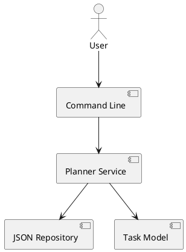
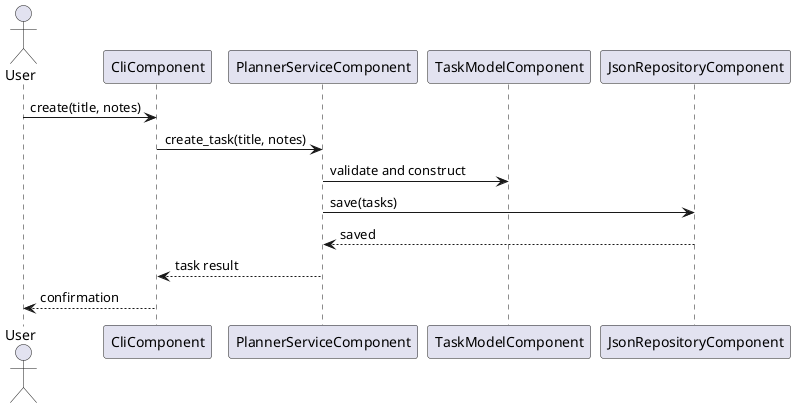

# Study Planner 架构视图

This view contains 2 PlantUML diagrams.

## Component Diagram

```plantuml
@startuml StudyPlannerComponents
actor User
component "Command Line" as CliComponent
component "Planner Service" as PlannerServiceComponent
component "JSON Repository" as JsonRepositoryComponent
component "Task Model" as TaskModelComponent

User --> CliComponent
CliComponent --> PlannerServiceComponent
PlannerServiceComponent --> TaskModelComponent
PlannerServiceComponent --> JsonRepositoryComponent
@enduml
```

## Create Task Sequence

```plantuml
@startuml CreateTaskSequence
actor User
participant CliComponent
participant PlannerServiceComponent
participant TaskModelComponent
participant JsonRepositoryComponent

User -> CliComponent: create(title, notes)
CliComponent -> PlannerServiceComponent: create_task(title, notes)
PlannerServiceComponent -> TaskModelComponent: validate and construct
PlannerServiceComponent -> JsonRepositoryComponent: save(tasks)
JsonRepositoryComponent --> PlannerServiceComponent: saved
PlannerServiceComponent --> CliComponent: task result
CliComponent --> User: confirmation
@enduml
```

