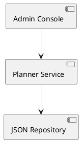

# Study Planner 冲突架构视图

The view contains exactly 1 PlantUML diagram.

## Components

```plantuml
@startuml StudyPlannerConflictView
component "Planner Service" as PlannerServiceComponent
component "JSON Repository" as JsonRepositoryComponent
component "Admin Console" as AdminComponent
PlannerServiceComponent --> JsonRepositoryComponent
AdminComponent --> PlannerServiceComponent
@enduml
```

